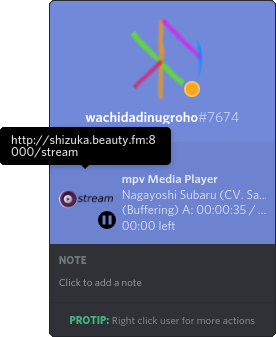
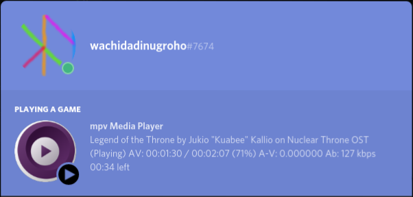
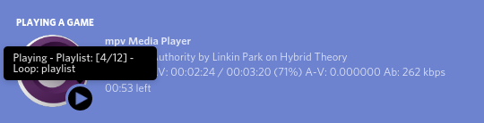
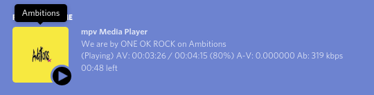
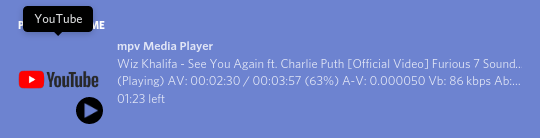
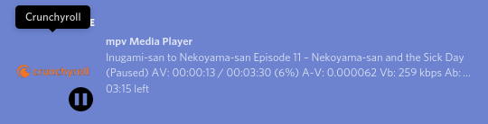

<center></center>
<h1 align="center"><a href="https://github.com/cniw/mpv-discordRPC">mpv-discordRPC</a></h1>
<p align="center"><b>Discord Rich Presence intergation for mpv Media Player</b></p>
<hr><p align="center">
This is alternative version, edited from <a href="https://github.com/noaione/mpv-discordRPC">mpv-discordRPC</a>.
I add metadata tags (Title, Artist and Album) support for 'details' and I use status-line for 'state'.
I use 'elapsed' time mode when idle, while when playing, paused, and buffering use 'left' time mode.
I add support and installer script for Linux, Mac and Windows.
I also add custom configuration file and new features: info, cover art, url detections, and active/inactive toggle.
</p><p align="right">
For more description read below.
</p>

---
## Previews
| Description | Image |
| :-: | :-: |
| Idle | 
| Playing | 
| Paused | 
| Info: playlist and loop | 
| Cover art | 
| YouTube playing | 
| Crunchyroll paused  | 
| SoundCloud playing | 
| LISTEN.moe paused  | 

---
## Used softwares
1. Provided by user: [mpv][mpv], [Discord][discord]
2. Included: [Discord RPC][discord-rpc], [status-line][status-line],
[lua-discordRPC][lua-discordRPC]
3. Optional: [Python][python], [pypresence][pypresence]

---
## Downloads
- Latest Releases [](https://github.com/cniw/mpv-discordRPC/releases/latest)
 
 
- All Releases [](https://github.com/cniw/mpv-discordRPC/releases)

---
## Instalation
1. For Linux, installing just run `install-linux.sh` on terminal.
2. For Windows, installing just run `install-win.bat` by double-clicking it.
3. For Mac, installing just run `install-osx.sh` on terminal.

---
## Settings
Just edit `mpv_discordRPC.conf` file in `script-opts` folder. Now Available 2
rpc_wrapper option, choose one. Example:
* Configuration (A) rpc_wrapper and periodic_timer
    ```conf
    rpc_wrapper=lua-discordRPC
    periodic_timer=1
    ```
* Configuration (B) rpc_wrapper and periodic_timer
    ```conf
    rpc_wrapper=python-pypresence
    periodic_timer=3
    ```
Setting to show playlist info and loop info. Example:
* Configuration playlist_info and loop_info
    ```conf
    playlist_info=yes
    loop_info=yes
    ```
Setting to show cover art. Example:
* Configuration cover_art
    ```conf
    cover_art=yes
    ```
Setting to active/inactive toggle the Discord RPC and the start states. Example:
* Configuration active and key_toggle
    ```conf
    active=yes
    key_toggle=D
    ```

### To use _`rpc_wrapper=lua-discordRPC`_, Important LuaJIT on mpv
Check [LuaJIT][luajit], because it has [FFI Library][ext_ffi] and it needed by
[lua-discordRPC][lua-discordRPC].
1. For Linux
    - Make sure your mpv binary linked to luajit~~ not lua~~ library.
        ```bash
        ldd $(which mpv) | grep luajit
        libluajit-5.1.so.2 => /usr/lib/x86_64-linux-gnu/libluajit-5.1.so.2 (0x00007f32e9a83000)
        ```
    - If it's dynamic build while it's static build you can check with
        ```bash
        mpv -v -V | sed -rn 's/.*(luajit).*/\1/p'
        luajit
        ```
2. For Windows ***(Don't worry)***
   - You can skip this because available mpv Windows build by [lachs0r][lachs0r]
   and [shinchiro][shinchiro] already use LuaJIT and it static build which
   configured with `--enable-static-build`.
3. For Mac ***(So sad)***
   - Until now, LuaJIT still have problem on Mac OS X. Also build mpv with
   LuaJIT on Mac OS X (read [mpv issue #1110][mpv issue #1110]), it maybe can
   build successfully but still can't load LuaJIT properly when run mpv (read
   [mpv issue #5205][mpv issue #5205]). You can check with `otool` command.

### To use _`rpc_wrapper=python-pypresence`_, Important to install pypresence
**Support Mac, Windows, and Linux** because can use with [Lua][lua] or [LuaJIT][luajit].
1. Install [Python][python] >=3.5 because this version has [asyncio][asyncio]
library which needed by pypresence.
2. Install [pypresence][pypresence] `pip install pypresence` or `pip install
https://github.com/qwertyquerty/pypresence/archive/master.zip` use `pip3`
instead of `pip` if Python 2 still installed on your old machine.

You may want to check again, run command `mpv -v -V` and find `luajit` or `lua`
word on the line which beginning with `[cplayer] List of enabled features:` for
Mac, Windows or Linux.

---
## Testing
1. Open your Discord then,
2. Open your mpv then,
3. Back to Discord and then check your profile.


Good Luck and have a nice day.

Feedback: If you have question, problem or request, please make new issue or
contact me wachidadinugroho#7674 via Discord.


[mpv]: https://mpv.io/installation/
[discord]: https://discordapp.com/download
[discord-rpc]: https://github.com/discordapp/discord-rpc
[lua-discordRPC]: https://github.com/pfirsich/lua-discordRPC
[pypresence]: https://github.com/qwertyquerty/pypresence
[status-line]: https://github.com/mpv-player/mpv/raw/master/TOOLS/lua/status-line.lua
[luajit]: http://luajit.org/
[ext_ffi]: http://luajit.org/ext_ffi.html
[lua]: https://www.lua.org/
[mpv issue #1110]: https://github.com/mpv-player/mpv/issues/1110
[mpv issue #5205]: https://github.com/mpv-player/mpv/issues/5205
[lachs0r]: https://mpv.srsfckn.biz/
[shinchiro]: https://sourceforge.net/projects/mpv-player-windows/files
[python]: https://www.python.org/downloads/
[asyncio]: https://docs.python.org/3/library/asyncio.html

